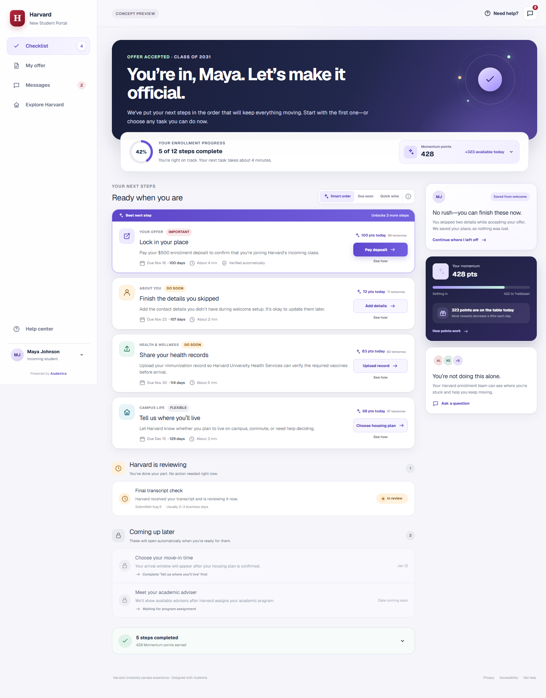

# Audentra

An enrollment platform for educational institutions. It walks newly admitted students through every
step of enrollment, ordered by what actually matters to them right now.

This repository is the **product base** — the design system and the student experience (the
enrollment checklist) already implemented in React, ready to grow a backend, authentication, and
support for multiple institutions.



> The portal shown is the **Harvard New Student Portal**, the sample institution used during
> development. Branding, copy, and data are placeholders for future per-tenant configuration.

## Stack

- **React 19** + **Vite 8** (JSX, no TypeScript)
- **Plain CSS** — in-house design system in `src/styles/app.css`, on top of a reset (Tailwind Preflight)
- **Geist / Geist Mono** self-hosted through `@fontsource-variable` (no external requests)
- No third-party UI dependencies: every component and icon is our own

## Running

```bash
npm install
npm run dev      # http://localhost:5173
npm run build    # outputs to dist/
npm run preview  # serves the production build
```

## Structure

```
index.html
public/favicon.svg
src/
  main.jsx                     # bootstrap + CSS and font imports
  App.jsx                      # application state + page layout
  Icon.jsx                     # inline SVG icon library (24x24, stroke 1.9)
  data.js                      # student data: tasks, locked, completed, in review
  lib/task-helpers.js          # sorting (smart/due/quick) and priority labels
  components/
    Sidebar.jsx                # side navigation + student profile
    Topbar.jsx                 # top bar
    TaskCard.jsx               # task card, with the "Best next step" banner
    TaskDrawer.jsx             # task drawer: payment, upload, form, choice
    InfoModal.jsx              # "Smart order" and "Momentum points" modals
    InsightColumn.jsx          # right column: resume, momentum, support
  styles/
    preflight.css              # base reset
    app.css                    # design system: tokens, layout, components, responsive
docs/preview.png               # screenshot of the main screen
```

## Domain model

Every checklist task (`src/data.js`) has this shape:

| Field | Description |
| --- | --- |
| `id` | stable identifier |
| `category` | grouping shown on the card (e.g. `Your offer`, `Campus life`) |
| `title` / `description` | student-facing copy, in plain language |
| `due` / `daysLeft` | deadline and days remaining |
| `points` / `tomorrow` | reward today and tomorrow (decays ~1 point per day) |
| `minutes` | effort estimate |
| `action` | primary button label |
| `kind` | `external` \| `upload` \| `profile` \| `form` — selects the drawer panel |
| `priority` | `critical` \| `soon` \| `normal` |
| `unlocks` | how many locked tasks open up on completion |
| `why` | rationale shown in the drawer ("Why this matters now") |
| `steps` | walkthrough for the "Step-by-step help" tab |

Three more state collections round it out: `lockedTasks` (blocked by a prerequisite),
`initialReviewing` (submitted, waiting on the institution), and `initialCompleted` (done, with
points).

## What's implemented

| Area | Behavior |
| --- | --- |
| Sorting | `Smart order` (priority → unlocks → deadline), `Due soon` (days remaining), `Quick wins` (duration) |
| Recommendation | "Best next step" banner on the first card, only under `Smart order` |
| Task drawer | `Do this now` / `Step-by-step help` tabs; the panel follows the task `kind` |
| Payment (`external`) | Simulates the institution confirming: completes the task, credits points, fires the toast |
| Upload (`upload`) | Requires picking a file before submit is enabled; moves the task to "reviewing" |
| Form (`profile`) | Contact fields with a skip option that keeps progress |
| Choice (`form`) | Housing plan selection with controlled state |
| Progress | Ring driven by `--progress` = `percentage × 3.6deg`, over a 12-step baseline |
| Momentum | Accumulated points, level bar `min(88, 54 + completed × 4)%`, and distance to the next level |
| Accessibility | Landmarks, `aria-label`/`aria-modal`/`role`, `Esc` closes drawer and modals, `prefers-reduced-motion` |
| Responsive | Sidebar becomes a drawer with a scrim; the task drawer becomes a bottom sheet |

## Design tokens

```css
--ink: #152037;      --muted: #687086;         --line: #e6e7ee;
--surface: #fff;     --canvas: #f5f5fa;
--purple: #6854d9;   --purple-dark: #4d3bb3;   --purple-soft: #efedff;
--crimson: #a51c30;  --green: #227a5b;         --green-soft: #e8f7f0;
--amber: #a65d19;    --amber-soft: #fff4df;
```

Typography is Geist (variable, 100–900) and Geist Mono. Radii, shadows, and spacing come from
`--shadow-soft` / `--shadow-card` and the scales defined in `app.css`.

## Next steps

This base covers the presentation layer and local state. What comes next:

- [ ] API and persistence (`src/data.js` is static today and state lives in memory)
- [ ] Student authentication and sessions
- [ ] Multi-tenant: branding, copy, deadlines, and point rules per institution
- [ ] Real document upload and the review workflow
- [ ] Payment integration (the button simulates confirmation today)
- [ ] Notifications and the messages tab
- [ ] Automated tests and CI

## License

Proprietary code owned by Audentra. The repository is public to read; no rights of use are granted.
